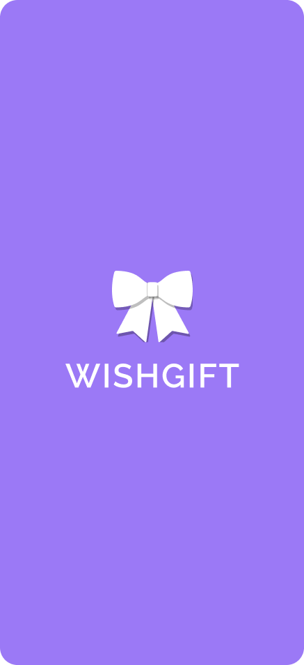
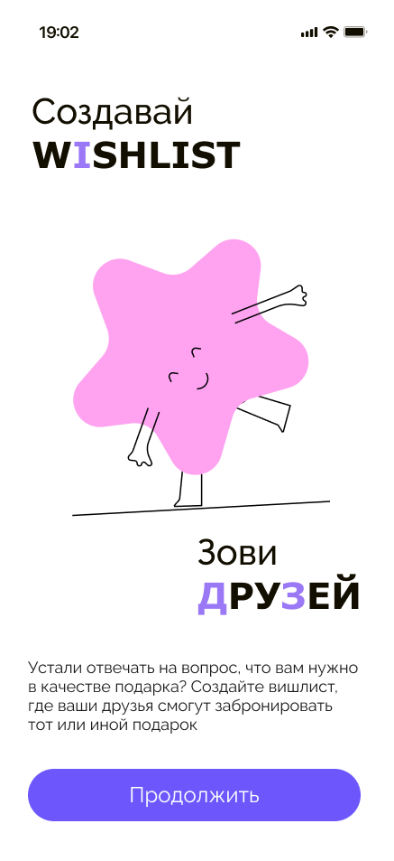
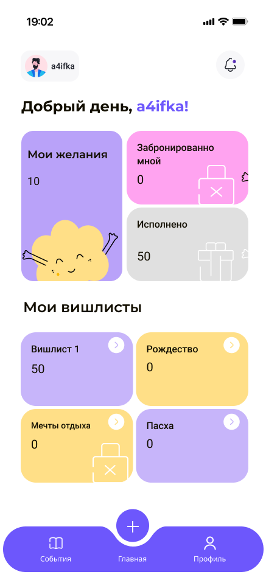

<div align="center">
  

  # 🎁 WishGift

  > Создавай вишлисты, зови друзей, получай именно то, что хочешь

  
  
  
  
  

</div>

---

## 📱 Screenshots

<div align="center">

<table>
  <tr>
    <td align="center">
      
      <br/><b>Splash Screen</b>
      <br/><sub>Приветственный экран</sub>
    </td>
    <td align="center">
      
      <br/><b>Онбординг</b>
      <br/><sub>Зови друзей, создавай вишлисты</sub>
    </td>
    <td align="center">
      
      <br/><b>Главная</b>
      <br/><sub>Мои желания и вишлисты</sub>
    </td>
    <td align="center">
      
      <br/><b>Карточка желания</b>
      <br/><sub>Цена, ссылки, магазины</sub>
    </td>
  </tr>
</table>

</div>

---

## ✨ Возможности

**🎀 Вишлисты** — создавай тематические списки желаний (Рождество, День рождения, Мечты и т.д.)

**👫 Совместный доступ** — приглашай друзей, они бронируют подарки и видят, что уже занято

**🛍 Карточка желания** — фото, цена, ссылки на магазины где можно купить

**📊 Статистика** — отслеживай сколько желаний исполнено, сколько забронировано

**🌍 Локализация (l10n)** — поддержка русского и английского языков через официальный Flutter l10n

---

## 🏗 Архитектура

Проект построен по принципам **Clean Architecture** с разделением на слои:

```
lib/
├── core/
│   ├── error/              # Обработка ошибок
│   ├── platform/           # Платформенные абстракции
│   └── usecases/           # Базовые usecase'ы
├── feature/
│   ├── data/
│   │   ├── datasource/     # Supabase / Local источники данных
│   │   ├── models/         # DTO модели
│   │   └── repositories/   # Реализации репозиториев
│   ├── domain/
│   │   ├── entities/       # Бизнес-сущности
│   │   ├── repositories/   # Абстракции репозиториев
│   │   └── usecases/       # Бизнес-логика
│   └── presentation/
│       ├── cubit/          # Управление состоянием
│       ├── pages/          # Экраны
│       └── widgets/        # UI компоненты
└── l10n/
    ├── app_en.arb          # Английская локализация
    └── app_ru.arb          # Русская локализация
```

---

## 🛠 Tech Stack

| Слой | Технологии |
|------|-----------|
| **Language** | Dart / Flutter |
| **State Management** | Cubit (flutter_bloc) |
| **DI** | get_it |
| **Architecture** | Clean Architecture (UseCase, Repository pattern) |
| **Database** | Supabase |
| **Localization** | Flutter l10n (официальная) |
| **Platform** | iOS & Android |

---

## 🚀 Установка и запуск

```bash
# Клонируй репозиторий
git clone https://github.com/a4ifka/wishgift.git
cd wishgift

# Установи зависимости
flutter pub get

# Сгенерируй локализацию
flutter gen-l10n

# Запусти
flutter run
```

Добавь в `main.dart` или `lib/main.dart`:

```dart
  await Supabase.initialize(
    url: 'URL',
    anonKey:
        'API_KEY',
  );
```

---

## 📦 Ключевые зависимости

```yaml
dependencies:
  flutter_bloc: # Cubit для управления состоянием
  get_it:        # Dependency Injection
  supabase_flutter: # База данных
  flutter_localizations: # l10n
```

---

<div align="center">

Made with 🎀 by [a4ifka](https://github.com/a4ifka) & [Epl-Grey](https://github.com/Epl-Grey)

</div>